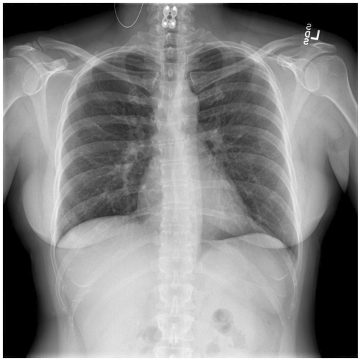
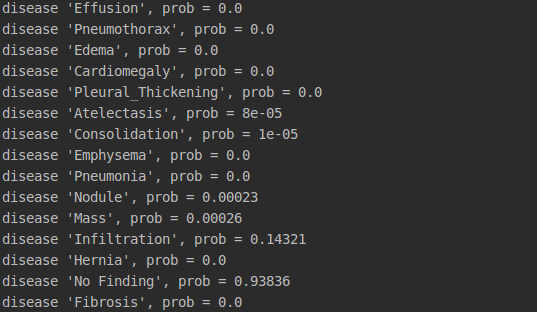

## Intro
A multi-label-classification model for chest diseases.

### Config
- python 2.7.15
- tensorflow 1.8.0
- python package 
    * nltk
    * PIL
    * json
    * numpy

It is all of common tookits, so I don't give their links.

### DataDownload and Prepare
- NIH Chest X-ray Dataset[(kaggle's download link)](https://www.kaggle.com/nih-chest-xrays/data)
    * you need copy 'Data_Entry_2017.csv' to dir 'data/'
    * you need unzip 'images_001.zip' - 'images_012.zip' to 'data/images'
    * you need copy 'train_val_list.txt' and 'test_list.txt' to 'data/'
- Pretrain VGG19 model
    * you need to download [vgg_19_2016_08_28.tar.gz](http://download.tensorflow.org/models/vgg_19_2016_08_28.tar.gz)
    * then extract it, copy 'vgg_19.ckpt' to 'data/pretrain_vgg/'

### Train
#### First, preprocess data
- get 'data_entry.json' and 'data_label.json'
    ```shell
    $ cd preprocess
    $ python get_data_entry.py    
    ``` 
- get 'data/tfrecord/train-xx.tfrecord', 'data/tfrecord/test-xx.tfrecord', 'train_tfrecord_name.txt' and 'test_tfrecord_name.txt'
    ```shell
    $ python datasets.py    
    ``` 
#### Second, let's go train
- you can check mlc_model.py to ensure accuracy
    ```shell
    $ python main.py    
    ``` 

### Test Demo
I will release a demo.py, you can use it to test.
- you could provide Chest CT image to test
    ```shell
    $ python demo.py --img='data/examples/CXR3_IM-1384-1001.png'   
    ``` 
- test demo example

    
    
    

### Experiments
#### Loss
At last, I trained 100 epoch and the train mlc_loss_weighted reduce to 0.0455, it wasted 36 hours. You can see detials in 'data/log.txt'.


#### AUC
When epoch = 20, iter = 28000, I eval the auc. Actually, when epoch > 15, the model is overfitting, so you don't need trian too many epoch.

|  | Ours | Paper | test num |
| :--- | :---: | :---: | :---: |
| Effusion | 0.7584 | 0.700 | 4658 |
| Pneumothorax | 0.7498 | 0.799 | 2665 |
| Edema | 0.7635 | 0.805 | 925 |
| Cardiomegaly | 0.7735 | 0.810 | 1069 |
| Pleural_Thickening | 0.7602 | 0.684 | 1143 |
| Atelectasis | 0.7532 | 0.700 | 3279 |
| Consolidation | 0.7399 | 0.703 | 1815 |
| Emphysema | 0.7385 | 0.833 | 1093 |
| Pneumonia | 0.7367 | 0.658 | 555 |
| Nodule | 0.7272 | 0.668 | 1623 |
| Mass | 0.7217 | 0.693 | 1748 |
| Infiltration | 0.7399 | 0.661 | 6112 |
| Hernia | 0.7520 | 0.871 | 86 |
| No Finding | 0.7782 | - | 9861 |
| Fibrosis | 0.7813 | 0.786 | 435 |
| Mean | 0.7516 | 0.745 | - |


### References
- Wang, Xiaosong, et al. **"Chestx-ray8: Hospital-scale chest x-ray database and benchmarks on weakly-supervised classification and localization of common thorax diseases."** Computer Vision and Pattern Recognition (CVPR), 2017 IEEE Conference on. IEEE, 2017.
- Wang, Xiaosong, et al. **"Tienet: Text-image embedding network for common thorax disease classification and reporting in chest x-rays."** Proceedings of the IEEE Conference on Computer Vision and Pattern Recognition. 2018.